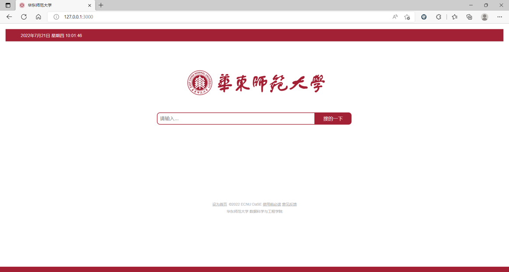

# Web-Project

基于 **Node.js** 的新闻爬虫和新闻展示网站

## dependencies

```javascript
require('request');
require('cheerio');
require('iconv-lite');
require('mysql');
require('jschardet');
require('express');
```

## Repository structure

```python
|-- crawler/ # 新闻爬虫
	|--.....
|-- search_site/  # 新闻展示网站
    |-- ......
|-- README.md
```

## Run

**初始化数据库**

- 在 crawler/database/mysql.js 内更改数据库连接信息
- 运行 init_db.js

```shell
node ./crawler/database/init_db.js
```

**新闻爬虫**

```shell
node ./crawler/crawler/crawler.js
```
**新闻展示网站**

```shell
node ./search_site/bin/www
```

## Show
仿华师大风格网页如下：




